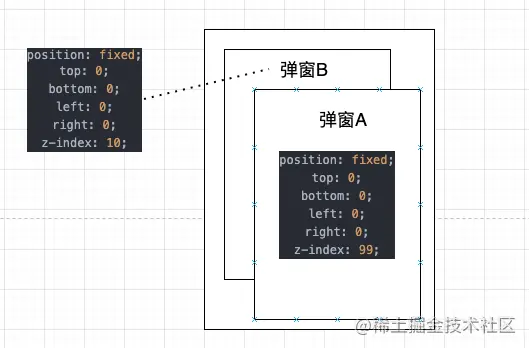

## 背景

页面上有一个带有全屏蒙层的弹窗A，弹窗的按钮点击之后会创建一个新的带全屏蒙层弹窗B，同时弹窗A消失。弹窗A的按钮上绑定了touchend事件，弹窗B的按钮和蒙层都上绑定了click事件，按钮的click事件会触发一定的业务逻辑，B的蒙层的click事件会让整个弹窗消失，从DOM结构中移除。页面结构抽象起来大致如下，两个占满全屏的弹窗AB：



令人疑惑的现象是：当我点击了弹窗A的按钮之后，弹窗B没有出现，通过log发现是触发了弹窗B的蒙层的Click事件，导致弹窗B从DOM中移除了。如果到这里你已经知道是什么原因导致的了，那么可以不需要继续往下阅读了。如果你还是一头雾水，欢迎继续阅读。

这里我准备了一个例子，可以下载这个[demo](https://link.juejin.cn/?target=https%3A%2F%2Fgithub.com%2Fdouyanlin%2Fjuejin_demo%2Fblob%2Fmaster%2Fclick_event%2Findex.html)在 chrome 打开，**记得在打开开发者工具调整成移动端展现**（不然不会触发 touch 事件）。在touch事件中我手动移除了`inner-mask`这个div，导致的结果就是，盖在下面的mask的click事件被触发了，我们可以看到 `click mask` 这个log。

为什么会发生这种情况，明明我们没有点击 mask 这个dom，它的click事件还是被触发了？下面我们就来讲讲点击事件那些事。

## **点击事件的触发顺序**

一次DOM点击事件的触发过程：

1. 触发touchstart事件
1. 触发touchmove事件
1. 触发touchend事件
1. 触发click事件

然后因为存在事件冒泡的存在我们的点击事件会向父节点传递，如果父节点也绑定了点击，则也会触发父组件的点击事件。这里比较有趣的是，假设我们有如下dom结构（可以查看这个[demo](https://link.juejin.cn/?target=https%3A%2F%2Fgithub.com%2Fdouyanlin%2Fjuejin_demo%2Fblob%2Fmaster%2Fclick_event%2Ftouch_click_order.html)）：

````jsx
<div class="body">
    <div class="inner-mask">ddd</div>
</div>
````

并且我们在每一个DOM节点和document上都挂载了 `touchstart`、`touchend`、`click`事件，那么他们的触发顺序为：

1. `div.inner-mask` 的 `touchstart` 事件
1. `div.body` 的 `touchstart` 事件
1. `document` 的 `touchstart` 事件
1. `div.inner-mask` 的 `touchend` 事件
1. `div.body` 的 `touchsend` 事件
1. `document` 的 `touchend` 事件
1. `div.inner-mask` 的 `click` 事件
1. `div.body` 的 `click` 事件
1. `document` 的 `click` 事件

聊完了点击事件的顺序，接下来聊聊为什么会出现上面的那种情况

## **点击事件那些隐藏逻辑**

通过查看W3C的规范，我发现了里面有这么一段：

 > 
 > If the contents of the document have changed during processing of the touch events, then the user agent may dispatch the mouse events to a different target than the touch events.

也就是说，如果touch事件触发的dom内容改变了（我们就是给它移除掉了），然后后面的点击事件会被分发到另一个对象上，所以说我们在touch事件中把inner-mask对象给移除掉了，那它后续还有click事件要执行呢，就分发到下面的 mask 上了，然后就出发了其click事件。

那有没有什么办法能处理这种情况呢，这种情况在业务开发过程中时肯定会存在的，再看一眼规范，里面提到：

 > 
 > If, however, either the touchstart, touchmove or touchend event has been canceled during this interaction, no mouse or click events will be fired

如果一个touch事件被取消了，则不会触发后续的 mouse 和 click事件，那如何取消一个touch事件后续流程呢，使用我们非常常用的 `preventDefault()` 就可以了。
我们在一开始的 [demo](https://link.juejin.cn/?target=https%3A%2F%2Fgithub.com%2Fdouyanlin%2Fjuejin_demo%2Fblob%2Fmaster%2Fclick_event%2Findex.html)里的touchend里补充一个 preventDefault()：

````jsx
innerMask.addEventListener('touchend', function(e){
  console.log('touch end inner mask')
  e.preventDefault()
})
````

然后我们可以看到，这里移除 `div.inner-mask`之后没有触发 `div.mask`的点击事件。

当然，也不是所有的 `EventListener`都能调用 `event.preventDefault()`的。
`addEventListener` 可以设置一个 `passive` 字段，如果为 `true`，在 `touchstart` 中调用 `preventDefault` 不会有任何效果，会有一个 `console warning`，但是 `touchend` 中还是可以调用 `preventDefault`的。`document`的 `passive` 默认就是 `true`。具体可以查看 [MDN](https://link.juejin.cn/?target=https%3A%2F%2Fdeveloper.mozilla.org%2Fen-us%2Fdocs%2FWeb%2FAPI%2FEventTarget%2FaddEventListener)：

 > 
 > passive：A Boolean that, if true, indicates that the function specified by listener will never call preventDefault(). If a passive listener does call preventDefault(), the user agent will do nothing other than generate a console warning.

## **框架对于点击事件的处理**

我们平时进行业务开发的时候肯定不是手写原生的html、js，肯定会用到各种框架，我上面遇到的这些问题实际上都是在 React 和 preact 开发过程中遇到的问题，所以我们看一下框架里对点击事件做了哪些处理。

### **preact对事件的处理**

Preact使用的是React语法来编写页面，但是其优势在于框架代码体积非常小，preact内部没有React那么复杂的事件合成机制，对于事件的绑定是直接绑定在原生DOM节点上的，但是为了性能考虑，做了一层 event proxy，不会影响事件处理函数的执行，精简后的代码如下：

````jsx
export function setProperty(dom, name, value, oldValue, isSvg) {
    // ...
    useCapture = name !== (name = name.replace(/Capture$/, ''));
    // Infer correct casing for DOM built-in events:
    if (name.toLowerCase() in dom) name = name.toLowerCase().slice(2);
    else name = name.slice(2);
    
    if (!dom._listeners) dom._listeners = {};
    dom._listeners[name + useCapture] = value;
    
    if (value) {
            if (!oldValue) {
                    const handler = useCapture ? eventProxyCapture : eventProxy;
                    dom.addEventListener(name, handler, useCapture);
            }
    } else {
            const handler = useCapture ? eventProxyCapture : eventProxy;
            dom.removeEventListener(name, handler, useCapture);
    }
    // ...
}

function eventProxy(e) {
    this._listeners[e.type + false](options.event ? options.event(e) : e);
}

function eventProxyCapture(e) {
    this._listeners[e.type + true](options.event ? options.event(e) : e);
}
````

完整代码[地址](https://link.juejin.cn/?target=https%3A%2F%2Fgithub.com%2Fpreactjs%2Fpreact%2Fblob%2F139a8625f31fa6aa53c8e74e10045f603ca9c180%2Fsrc%2Fdiff%2Fprops.js%23L98)

### **React对事件的处理**

React是框架内部自己做的合成事件，模拟事件冒泡和捕获，但是这个过程本身不会影响事件的触发。

React v16版本的事件是统一在 `document` 上处理的，所以默认是 `passive: true`，上面我们提到了 `passive` 会导致 `touchstart` 的 `preventDefault` 触发有问题，没有效果。

React v17上对事件系统进行了改进，将事件绑定在 root dom上，那这样是不是说使用React v17之后 点击事件就和preact效果一样了呢？答案是否定的，React 内部有一个处理是，当 一个节点有 `touchstart`、`touchmove`、`wheel` 事件时，则会设置 `passive: true`，还是会导致 `touchstart` 中的 `preventDefault` 失效。

精简后的React内部对于事件绑定的代码如下：

````jsx
function addTrappedEventListener(
  targetContainer: EventTarget,
  domEventName: DOMEventName,
  eventSystemFlags: EventSystemFlags,
  isCapturePhaseListener: boolean,
  isDeferredListenerForLegacyFBSupport?: boolean,
) {
  let listener = createEventListenerWrapperWithPriority(
    targetContainer,
    domEventName,
    eventSystemFlags,
  );
  
  let isPassiveListener = undefined;
  if (passiveBrowserEventsSupported) {
    if (
      domEventName === 'touchstart' ||
      domEventName === 'touchmove' ||
      domEventName === 'wheel'
    ) {
      isPassiveListener = true;
    }
  } 
  // ...
  if (isCapturePhaseListener) {
    if (isPassiveListener !== undefined) {
      unsubscribeListener = addEventCaptureListenerWithPassiveFlag(
        targetContainer,
        domEventName,
        listener,
        isPassiveListener,
      );
      
  // ....
  
}
````

React为什么要这样处理呢？为什么非要设置 passive: true不可呢？通过查找[资料](https://link.juejin.cn/?target=https%3A%2F%2Fdeveloper.mozilla.org%2Fen-us%2Fdocs%2FWeb%2FAPI%2FEventTarget%2FaddEventListener%23improving_scrolling_performance_with_passive_listeners)个人猜测，使用passive listener在某些情况下会带来性能上的优化：

 > the potential for event listeners handling certain touch events (among others) to block the browser's main thread while it is attempting to handle scrolling, resulting in possibly enormous reduction in performance during scroll handling.
 > To prevent that problem, browsers other than Safari and Internet Explorer have changed the default value of the `passive` option to `true` for the `[wheel](https://developer.mozilla.org/en-US/docs/Web/API/Element/wheel_event)`, `[mousewheel](https://developer.mozilla.org/en-US/docs/Web/API/Element/mousewheel_event)`, `[touchstart](https://developer.mozilla.org/en-US/docs/Web/API/Element/touchstart_event)` and `[touchmove](https://developer.mozilla.org/en-US/docs/Web/API/Element/touchmove_event)` events on the document-level nodes `[Window](https://developer.mozilla.org/en-US/docs/Web/API/Window)`, `[Document](https://developer.mozilla.org/en-US/docs/Web/API/Document)`, and `[Document.body](https://developer.mozilla.org/en-US/docs/Web/API/Document/body)`. That prevents the event listener from [canceling the event](https://developer.mozilla.org/en-US/docs/Web/API/Event/preventDefault), so it can't block page rendering while the user is scrolling.
