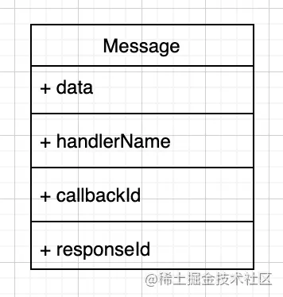
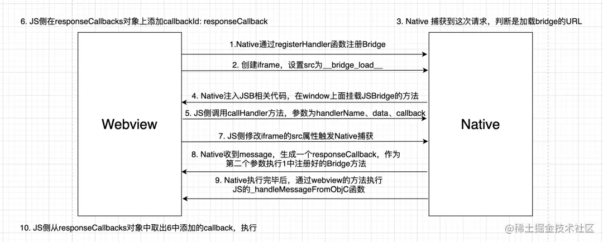
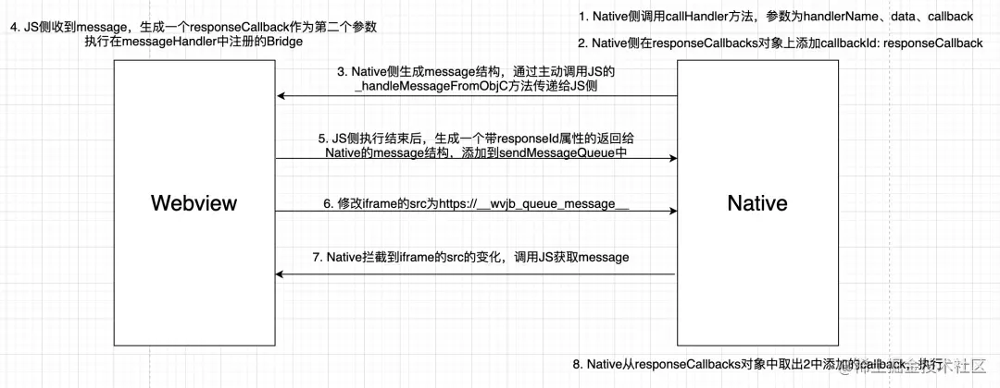

移动互联网的发展，Hybrid开发已经基本成了各个App的标配。Hybrid就是Native、H5混合开发技术，Android有 webview 、iOS 有 UIWebview和 WKWebview，这些控件可以加载并渲染 Html 文件。配合 HTML5，前端将战场从PC开拓到了Native App上。

为什么要混合开发？因为Native和H5都有各自的优缺点：

|特性|H5|Native|
|------|--|------|
|灵活性|无需发版，直接上线|需要跟版本，体验新功能用户需升级到最新版|
|稳定性|弱网环境下体验差，需要加载，不够流畅|网络环境无关，相比之下更加流畅|
|功能|能使用的Api有限|可以使用各种原生Api|
|通用性|一份代码，两端（iOS&Android）运行|两份代码|

本着互补的原则，在App开发中，需要较高的体验、比较稳定的功能，我们可以让Native去写；功能需要较高的灵活性、体验要求弱一些的地方使用H5开发，大家各取所长，保证快速迭代，毕竟国内互联网环境，谁家迭代的慢，在竞争中可能就会输的很惨。

上面表格也提到了，H5能使用的Api有限，那么当我一个H5页面需要调用各种原生的Api时该怎么办呢？这里就需要请出今天的主角JSBridge来帮我们处理H5和Native之间的通信问题了。

## **什么是JSBridge**

从名字我们就可以看出，Bridge是一个桥梁，连接起JS和Native，使得两个本来互相隔离的“孤岛”能够通信。H5可以通过Bridge调用Native的能力，Native也可以调用JS执行，Nice。

常见的跨平台框架ReactNative、Cordova都是使用JSBridge处理js和native之间的通信的。

## JSBridge的原理

这里我打算通过一个 Native 的 JSBridge 库来介绍 JSBridge 的原理。
`WebviewJavascriptBridge`算是一个非常有名的开源JSBridge开源库了，Github上目前已经有13.2k的star。Facebook Messenger、Facebook Paper等都在使用。我们就从这个库出发探究Bridge的原理。

这里补充一点，常用的实现JSBridge方式有两种：

* 拦截URL请求
* MessageHandler

WebviewJavascriptBridge这里使用的是第一种拦截URL的方式。

## WebviewJavascriptBridge源码分析

这个库的目录结构十分的简单：

````
|-- WebviewJavascriptBridge
    |-- WebviewJavascriptBridge_JS.h
    |-- WebviewJavascriptBridge_JS.m
    |-- WebviewJavascriptBridge.h
    |-- WebviewJavascriptBridge.m
    |-- WebviewJavascriptBridgeBase.h
    |-- WebviewJavascriptBridgeBase.m
    |-- WKWebviewJavascriptBridge.h
    |-- WKWebviewJavascriptBridge.m
````

非常简单粗暴的8个文件，上面说到iOS有两种 Webview ，上面目录中的 `WebviewJavascriptBridge.h` 和 `WKWebviewJavascriptBridge.h` 分别是 UIWebview 和 WKWebview 使用的头文件。本次分析只会看WKWebview 相关的部分。

### **使用方法**

先了解一下使用方法，以帮助我们更好的理解。从Readme里看到，这个bridge的使用还是很简单的，首先在 iOS代码中注册好一个Bridge，不了解OC代码的同学不需要担心，OC的代码非常易读，并且这里我会详细的说明必要的OC代码的含义，这里就是简单的注册了一个名为Objc Echo的方法。

````objectivec
[self.bridge registerHandler:@"ObjC Echo" handler:^(id data, WVJBResponseCallback responseCallback) {
  NSLog(@"ObjC Echo called with: %@", data);
  responseCallback(data);
}];
````

然后在前端的 `script`标签中写入 `setupWebViewJavascriptBridge` 函数并调用：

````tsx
function setupWebViewJavascriptBridge(callback) {
  if (window.WebViewJavascriptBridge) { return callback(WebViewJavascriptBridge); }
  if (window.WVJBCallbacks) { return window.WVJBCallbacks.push(callback); }
  window.WVJBCallbacks = [callback];
  var WVJBIframe = document.createElement('iframe');
  WVJBIframe.style.display = 'none';
  WVJBIframe.src = 'https://__bridge_loaded__';
  document.documentElement.appendChild(WVJBIframe);
  setTimeout(function() { document.documentElement.removeChild(WVJBIframe) }, 0)
}
setupWebViewJavascriptBridge(function(bridge) {

  bridge.registerHandler('JS Echo', function(data, responseCallback) {
    console.log("JS Echo called with:", data)
    responseCallback(data)
  })
  bridge.callHandler('ObjC Echo', {'key':'value'}, function responseCallback(responseData) {
    console.log("JS received response:", responseData)
  })
})
````

那当我们首次执行 `setupWebViewJavascriptBridge` 函数的时候，在window下面是肯定没有 `WebViewJavascriptBridge` 和`WVJBCallbacks` 这两个对象的，所以会跳过这两个if判断，下面的主要就做了以下几件事：

1. 创建一个名为WVJBCallbacks的数组，将传入的callback参数放到数组内
1. 创建一个iframe，设置不可见，设置src为 `https://__bridge_loaded__`
1. 设置定时器移除这个iframe

上面提到，实现jsbridge的方式有拦截URL请求的方式，这里创建iframe设置src的目的就是为了让我们的webview拦截到这个请求，并进行特定的操作，那webview拦截到这个请求之后做了什么呢？

### **分析Native和JS的源码**

看到这里你可能会问了：这不是写给前端工程师的原理吗，咋还分析上Native的源码了，这能看懂吗？
同学，坐下，不要慌张，你看不懂的话，听我给你分析不就看懂了吗 \[dog\]，代码我已经精简过了，并且OC代码很易读的\[dog\]。

这里主要就分析 WKWebview相关的bridge源码了。
WKWebview提供了 `webView:decidePolicyForNavigationAction:decisionHandler:` 方法用来监听一次 `navigation` ，可以在这里面进行逻辑判断（比如，这个请求是否真的要发出去），知识点就介绍到这里，接下来看源码：

````tsx
- (void)webView:(WKWebView *)webView decidePolicyForNavigationAction:(WKNavigationAction *)navigationAction decisionHandler:(void (^)(WKNavigationActionPolicy))decisionHandler {
    if (webView != _webView) { return; }
    NSURL *url = navigationAction.request.URL;

    if ([_base isWebViewJavascriptBridgeURL:url]) {
        if ([_base isBridgeLoadedURL:url]) {
            [_base injectJavascriptFile];
        } else if ([_base isQueueMessageURL:url]) {
            [self WKFlushMessageQueue];
        } else {
            [_base logUnkownMessage:url];
        }
        decisionHandler(WKNavigationActionPolicyCancel);
        return;
    }
    // ...
}
````

当我们用上面的方法拦截到了访问的 URL ，然后进行了一波 if……else 判断：
首先判断是不是jsbridge相关的 URL ：`isWebViewJavascriptBridgeURL` ，bridge相关的URL有什么特点呢？

* 协议头满足 https 或 wvjbscheme 开头
* host等于 `__bridge_load__` 或 `__wvjb_queue_message__`

当URL满足上面的条件时，说明是一次触发与 Native 交互的请求，而不是一次网页请求，继续判断：
如果URL是 触发加载 Bridge 的 URL，即满足 `[_base isBridgeLoadedURL:url]` ，也就是当 host 为 `__bridge_load__` 时，会执行injectJavascriptFile方法，听名字也能知道这个函数的作用是：向webview注入Javascript文件。

这里的 `__bridge_load__` 是不是觉得很眼熟，眼熟就对了。在我们上面的使用方法 `setupWebViewJavascriptBridge` 这个方法就将iframe的src属性设置成了 `__bridge_load__` 。当Native捕获到这个请求之后就执行 inject 方法注入js文件了。具体注入的是什么文件呢？就是 目录结构 中唯一带有JS两个大字的文件 `WebviewJavascriptBridge_JS.m` 。这个文件对于我们前端工程师来讲就非常简单了，因为你打开这文件之后，映入眼帘的基本上都是JS代码，这大概100多行的JS代码，最重要的事情就是：在window对象上挂载`WebViewJavascriptBridge`属性，具体值如下：

````tsx
window.WebViewJavascriptBridge = {
  registerHandler: registerHandler, // 注册一个js侧的事件供native调用
  callHandler: callHandler, // 调用native的方法
  disableJavscriptAlertBoxSafetyTimeout: disableJavscriptAlertBoxSafetyTimeout, // 忽略
  _fetchQueue: _fetchQueue, // 获取 消息队列（messageQueue）中的所有的message，传递给native
  _handleMessageFromObjC: _handleMessageFromObjC // 处理OC发过来的事件
};
````

除了WebViewJavascriptBridge以外我们还要关注一下 js代码中定义的一些全局变量，各个值的含义已经标注：

````tsx
var sendMessageQueue = []; // 保存调用jsbridge时生成的message，后面会一起发送给native
var messageHandlers = {}; // 保存js侧注册的jsbridge

var responseCallbacks = {}; // 保存 jsbridge的回调函数
var uniqueId = 1; // 每个message都有一个唯一的id，每生成一个message，uniqueId += 1
````

### **注册Bridge的过程**

当调用registerHandler注册一个bridge时，就是向 messageHandlers 中新增一条属性key为bridge的名字，value为回调函数callback，这个在JS侧注册的bridge是用来给Native调用的。

````tsx
function registerHandler(handlerName, handler) {
  messageHandlers[handlerName] = handler;
}
````

同样，在Native侧也有一个register方法，作用和JS侧的是一样的：

````objectivec
- (void)registerHandler:(NSString *)handlerName handler:(WVJBHandler)handler {
    _base.messageHandlers[handlerName] = [handler copy];
}
````

### **调用Bridge的过程**

Native和JS都注册好了Bridge之后，就等待双方互相调用了。先看JS侧如何调用Native侧注册的Bridge：

````objectivec
bridge.callHandler('ObjC Echo', {'key':'value'}, function responseCallback(responseData) {
    console.log("JS received response:", responseData)
})
````

调用Bridge都是调用callHandler方法，方法参数分别是：bridge的名字，传给Native的数据，回调函数。

````jsx
function callHandler(handlerName, data, responseCallback) {
    if (arguments.length == 2 && typeof data == 'function') {
        responseCallback = data;
        data = null;
    }
    _doSend({ handlerName:handlerName, data:data }, responseCallback);
}
function _doSend(message, responseCallback) {
  if (responseCallback) {
    var callbackId = 'cb_'+(uniqueId++)+'_'+new Date().getTime();
    responseCallbacks[callbackId] = responseCallback;
    message['callbackId'] = callbackId;
  }

  sendMessageQueue.push(message);
  messagingIframe.src = 'https://__wvjb_queue_message__'
}
````

调用`callHandler`，会生成一个message结构，添加到定义好的`sendMessageQueue`这个数组中。如果有`responseCallback`的话，将`responseCallback`添加到全局的`responseCallbacks`对象中，以便后面接收到native的执行完jsb触发回调函数执行。然后修改iframe的src属性，触发Native捕获URL。message结构如下：



这次设置的URL是`https://__wvjb_queue_message__` , 上面提到过webview会检查这次的调用是不是jsbridge相关的url，这次的URL也明显满足触发bridge相关事件，会调用 `WKFlushMessageQueue` 函数（函数见下方），获取到JS侧的`sendMessageQueue`中的所有message（`[_webView evaluateJavaScript:[_base webViewJavascriptFetchQueyCommand]` 实际上是让JS执行`_fetchQueue`方法获取`sendMessageQueue`中的所有message传递给Native）

````jsx
- (void)WKFlushMessageQueue {
    [_webView evaluateJavaScript:[_base webViewJavascriptFetchQueyCommand] completionHandler:^(NSString* result, NSError* error) {
        [_base flushMessageQueue:result];
    }];
}
- (void)flushMessageQueue:(NSString *)messageQueueString{
  // ...
    id messages = [self _deserializeMessageJSON:messageQueueString];
    for (WVJBMessage* message in messages) {
    // ...

        [self _log:@"RCVD" json:message];

        NSString* responseId = message[@"responseId"];
        // 尝试取 responseId，如取到则表明是回调，从 _responseCallbacks 取匹配的回调 block 执行
        if (responseId) {
            WVJBResponseCallback responseCallback = _responseCallbacks[responseId];
            responseCallback(message[@"responseData"]);
            [self.responseCallbacks removeObjectForKey:responseId];
        } else { // 未取到 responseId，则表明是正常的 JS callHandler 调用 iOS
            WVJBResponseCallback responseCallback = NULL;
            NSString* callbackId = message[@"callbackId"];
            if (callbackId) {
                responseCallback = ^(id responseData) {
                    if (responseData == nil) {
                        responseData = [NSNull null];
                    }           
                    WVJBMessage* msg = @{ @"responseId":callbackId, @"responseData":responseData };
                    [self _queueMessage:msg];
                };
            } else {
                responseCallback = ^(id ignoreResponseData) {
                    // Do nothing
                };
            }   
            WVJBHandler handler = self.messageHandlers[message[@"handlerName"]];

            handler(message[@"data"], responseCallback);
        }
    }
}
````

当一个message结构存在responseId的时候说明这个message是执行bridge后传回的。取不到responseId说明是第一次调用bridge传过来的，这个时候会生成一个返回给调用方的message，其reponseId是传过来的message的callbackId，当Native执行responseCallback时，会触发_dispatchMessage方法执行webview环境的的js函数（WebViewJavascriptBridge.\_handleMessageFromObjC方法），将生成的包含responseId的message返回给JS侧。

````jsx
- (void)_dispatchMessage:(WVJBMessage*)message {
    NSString *messageJSON = [self _serializeMessage:message pretty:NO];
    [self _log:@"SEND" json:messageJSON];
    /* 省略部分代码 */
    NSString* javascriptCommand = [NSString stringWithFormat:@"WebViewJavascriptBridge._handleMessageFromObjC('%@');", messageJSON];
    if ([[NSThread currentThread] isMainThread]) {
        [self _evaluateJavascript:javascriptCommand];

    } else {
        dispatch_sync(dispatch_get_main_queue(), ^{
            [self _evaluateJavascript:javascriptCommand];
        });
    }
}
````

如果从native获取到的message中有`responseId`，说明这个message是JS调Native之后回调接收的message，所以从一开始sendData中添加的`responseCallbacks`中根据`responseId`（一开始存的时候是用的`callbackId`，两个值是相同的）取出这个回调函数并执行，这样就完成了一次JS调用Native的流程。

````jsx
function _doDispatchMessageFromObjC() {
  var message = JSON.parse(messageJSON);
  var messageHandler;
  var responseCallback;

  if (message.responseId) { // 有responseId说明是 回调
    responseCallback = responseCallbacks[message.responseId];
    if (!responseCallback) {
      return;
    }
    responseCallback(message.responseData);
    delete responseCallbacks[message.responseId];
  } else { // 没有responseId说明是 一次native调用 js
    // ...
  }
}
````

整体的流程梳理成图就如下：



Native调用JS注册的Bridge的逻辑是相似的，不过就不是通过触发iframe的src触发执行的了，因为Native可以自己主动调用JS侧的方法。通过代码可以看出来JS和Native两侧注册的变量和函数都是对称的，所以Native调用JS的过程这里就不继续了。大概流程如下：



### 为什么要用iframe

读到了最后，我猜你还有一个疑问：既然webview能拦截到url的变化，为什么要修改iframe的src，而不是直接设置location.href？

为什么用iframe？通过 location.href 有个问题，就是如果 JS 多次调用原生的方法也就是 location.href 的值多次变化，Native 端只能接受到最后一次请求，前面的请求会被忽略掉，而iframe的多次设置不会出现这个问题，所以这里用了iframe。
